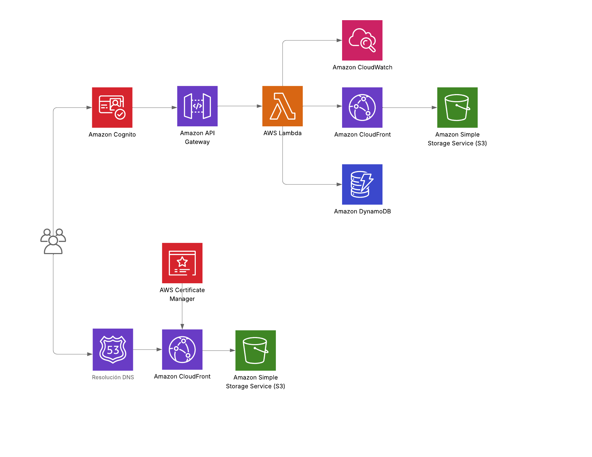

# CloudPhotos

Este proyecto está basado en crear un mini cloud de fotos personal, enfocándome en una arquitectura serverless usando servicios de AWS.

## Arquitectura

He usado estos servicios:

- **Amazon Route 53**: He generado a partir del dominio `portfolio-adrianriera.com` un subdominio llamado `project-photos-2.portfolio-adrianriera.com`.
- **Amazon S3**: Aquí he almacenado todo el contenido estático de la web, también se han almacenado aquí las fotos separándolas en carpetas según el ID del usuario.
- **Amazon Cloudfront**: Distribuye las fotos y el contenido de la web a nivel global, con baja latencia y alta disponibilidad.
- **AWS Certificate Manager (ACM)**: Certificado para permitir HTTPS y conexión segura.
- **Amazon Cognito User Pools**: Servicio de identidad y acceso. Almacena usuarios, gestiona el login y está configurado como Proveedor de Identidad Federada para permitir el inicio de sesión con Google.
- **Amazon API Gateway**: Servicio que permite enrutar y conectar el lambda.
- **AWS Lambda**: Es el corazón del backend donde reside la lógica de negocio (POST, GET, DELETE de fotos). Utiliza boto3 para interactuar con S3 y DynamoDB. La validación de tokens JWT de Cognito se realiza aquí para autorizar las acciones de cada usuario.
- **Cloudwatch**: Al usar lambda se genera un registro automático en Cloudwatch donde visualizo todos los logs de las funciones que se ejecuten en el lambda.
- **DynamoDB**: Para almacenar todos los metadatos de las fotos: su ID, user ID, nombre, s3_key, URL de CloudFront y estado. Sirve para garantizar que cada usuario solo acceda a sus propias fotos (autorización basada en el user ID).

La arquitectura completa sigue este flujo:

1.  **Acceso y Contenido Estático:** El usuario se conecta al subdominio `project-photos-2.portfolio-adrianriera.com`. **Route 53** dirige el tráfico a **CloudFront**, que sirve el contenido estático de la web (HTML, JS, CSS) almacenado en **S3**.
2.  **Autenticación (Login):** El usuario inicia sesión mediante **Google OAuth2**. La aplicación conecta directamente con **Amazon Cognito** para federar la identidad de Google. Cognito, una vez completado el *login*, emite un **Token JWT** al navegador del usuario.
3.  **Llamada a la API (Ejemplo: Obtener Fotos):** La aplicación cliente adjunta el **Token JWT** a una solicitud dirigida a **API Gateway**.
4.  **Autorización y Cómputo:** **API Gateway** reenvía la solicitud a **AWS Lambda**. La Lambda valida el Token JWT de Cognito y extrae el **user ID**.
5.  **Recuperación de Datos:** Usando el `user ID`, Lambda consulta **DynamoDB** para obtener los metadatos (ID, nombre, **URL de CloudFront**) de las fotos de ese usuario.
6.  **Visualización:** Lambda devuelve la lista de metadatos al cliente. El navegador utiliza las **URLs de CloudFront** contenidas en los metadatos para cargar las imágenes directamente desde la CDN, evitando pasar por Lambda y S3.

## CI/CD (GitHub Actions)

Todo push que haga a la rama `main` automáticamente hará:

1. Borrará todo el contenido que haya en el bucket `bucket-project-photos-2.portfolio-adrianriera.com` y lo sincronizará con el contenido actual del repositorio.
2. Invalidará la distribución de Cloudfront con id (`E2A3SQ8DTP8JXT`) ligada al S3 del contenido estático de la web. Esto forzará la cache para que se visualice el contenido nuevo generado.
3. Uso GitHub secrets (`AWS_ACCESS_KEY_ID` y `AWS_SECRET_ACCESS_KEY`) para la seguridad de la autenticación con AWS.

## Costos 

Al ser un proyecto personal es muy improbable llegar al millón de requests en Lambda o en API Gateway, por lo que el costo operacional por tráfico de los servicios es de **0,00 €**. También hay que tener en cuenta que en S3 empieza a cobrar al llegar al GB almacenado cosa muy improbable también. En conclusión los únicos cargos fijos provienen del servicio DNS.

### Costos Fijos Mensuales

Estos cargos son recurrentes, independientemente del tráfico, ya que son necesarios para la presencia en Internet del proyecto:

| Componente | Detalle | Costo Estimado Mensual |
| :--- | :--- | :--- |
| **Amazon Route 53 (Zona Alojada)** | Cargo fijo por la Zona Alojada (`project-photos-2.portfolio-adrianriera.com`). | **~0,40 €** |
| **Amazon Route 53 (Dominio)** | Costo anual del dominio es de 15 €. | **~1,25 €** |
| **Total Mensual Estimado** | (Costo Operacional + Costo Fijo) | **~1,65 €** |

## Troubleshoots

Uno de los grandes problemas que tuve fue en el CORS, específicamente en el manejo del método `OPTIONS`. Las solicitudes como POST, PUT, DELETE... que incluyen el encabezado Authorization (activado en el CORS para que maneje los ids de los usuarios en las peticiones) necesitan el método OPTIONS en ambos (Lambda y API Gateway) ya que es el encargado de hacer un chequeo antes de enviar la petición solicitada, por esta razón al realizar cualquier petición me saltaba este error: `Access-Control-Allow-Origin`

### Solución

Tener activado el OPTIONS en el API Gateway y tener la función de OPTIONS en el lambda.

## Despliegue

El link de acceso al proyecto es: [https://project-photos-2.portfolio-adrianriera.com](https://project-photos-2.portfolio-adrianriera.com)

